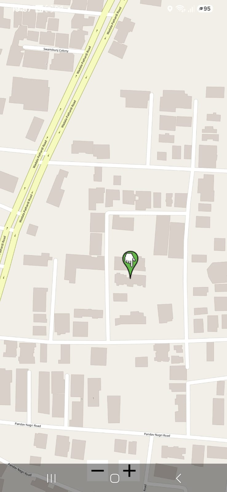

# Offline Maps Android

An offline-first Android Maps application built using **OSMDroid** and **OpenStreetMap**.

## Features

- 📍 Live GPS location
- 🗺️ OpenStreetMap integration
- 📌 Real-time "You are Here" marker
- 🤏 Pinch-to-zoom and map gestures
- 📱 Built using Jetpack Compose + OSMDroid

## Tech Stack

- Kotlin
- Jetpack Compose
- OSMDroid
- OpenStreetMap
- Fused Location Provider

## Screenshots

### Live Location

## Current Status

✅ Map rendering

✅ GPS permissions

✅ Live location updates

✅ Moving location marker

---

Next milestones:

- Offline map download
- MBTiles support
- Geofencing
- Route navigation
